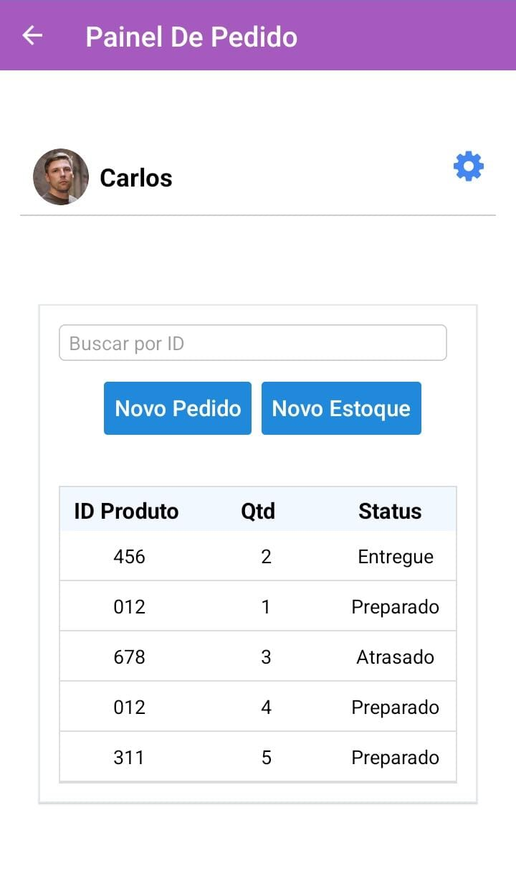
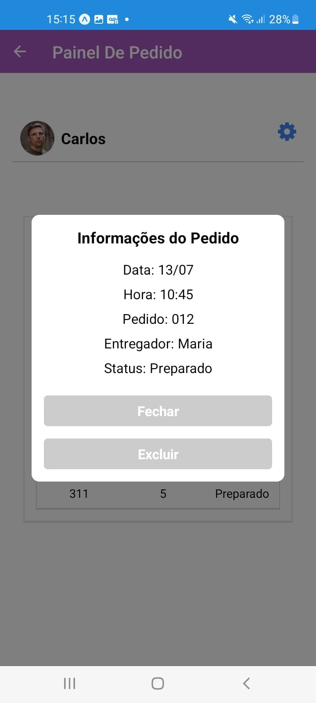

<h2>ShoppingMobile</h2>
 

<h3><strong>Tela de Login</strong></h3>
 

Ao abrir o aplicativo, a primeira tela que você encontrará é a de login. Nessa etapa, você precisará inserir suas credenciais de acesso, que normalmente consistem em um nome de usuário ou e-mail e uma senha. O campo "Acessar" é onde você pode efetuar o login utilizando suas informações de conta já cadastradas anteriormente.

 
<h3><strong>Botão "Cadastre-se"</strong></h3>

 

Caso você ainda não tenha uma conta no ShoppingMobile, pode utilizar a opção "Cadastre-se" presente na tela de login. Ao clicar nesse botão, você será direcionado para o formulário de registro, onde deverá fornecer algumas informações pessoais para criar sua conta no aplicativo. Essas informações geralmente incluem nome, e-mail, senha e talvez outros detalhes relevantes para o cadastro.

 
<h3><strong>Botão "Esqueci minha senha"</strong></h3>

 

Se por acaso você esquecer sua senha de acesso ao ShoppingMobile, não se preocupe! O aplicativo disponibiliza a opção "Esqueci minha senha" para ajudar a recuperá-la. Ao clicar nesse botão, você receberá instruções sobre como redefinir sua senha. Normalmente, isso envolve o recebimento de um e-mail com um link para redefinição, permitindo que você escolha uma nova senha para a sua conta.

<h3><strong>Painel de Pedidos - Detalhando suas compras</strong></h3>

 

Visualização do Pedido: O Painel de Pedidos exibirá uma lista com os IDs dos pedidos feitos pelo usuário. Cada ID corresponderá a uma compra específica realizada no aplicativo. Ao lado de cada ID, será mostrada a quantidade total de itens contidos em cada pedido, permitindo que o usuário tenha uma noção rápida da quantidade de produtos em cada compra.

 

Status do Pedido: Junto a cada ID de pedido, o Painel exibirá o status atual da entrega. Os status podem variar entre "Em Processamento", "Enviado", "Em Trânsito" e "Entregue", dependendo do estágio em que o pedido se encontra. Isso permitirá que o usuário acompanhe o progresso de suas entregas e saiba quando o pedido foi concluído.

<h3><strong>Pesquisa por ID do Pedido</strong></h3>
 

Para facilitar ainda mais a busca de informações específicas sobre um determinado pedido, o ShoppingMobile oferece uma ferramenta de pesquisa que permite ao usuário inserir o ID do pedido desejado. Ao digitar o número do pedido no campo de busca e pressionar "Pesquisar", o aplicativo encontrará rapidamente o pedido correspondente e exibirá suas informações detalhadas.

<h3><strong>Visualização Detalhada do Pedido</strong></h3>

 

Quando o usuário encontrar o pedido que deseja obter mais informações, basta clicar no ID do pedido na lista. Ao fazer isso, um "Dialog" (caixa de diálogo) será exibido, fornecendo uma visualização detalhada do pedido selecionado. Nessa visualização, o usuário terá acesso às seguintes informações:
Data e Hora do Pedido: Será exibida a data e o horário exatos em que o pedido foi realizado, permitindo ao usuário rastrear a cronologia da compra.
Descrição do Pedido: O aplicativo mostrará uma lista dos itens comprados no pedido, detalhando os produtos adquiridos, a quantidade de cada item e os respectivos preços.
Nome do Entregador: Caso o pedido já esteja em trânsito ou tenha sido entregue, o nome do entregador encarregado será mostrado, permitindo que o usuário saiba quem está responsável pela entrega.
Status Detalhado: Além do status exibido no Painel de Pedidos, o diálogo fornecerá informações mais detalhadas sobre o andamento do pedido, como o trajeto de entrega, previsão de chegada, entre outros detalhes relevantes.
Com o Painel de Pedidos e a funcionalidade de busca por ID do Pedido, o ShoppingMobile oferece aos usuários uma maneira simples e prática de acompanhar suas compras, garantindo uma experiência de compra mais transparente e satisfatória. Aproveite todas essas facilidades e benefícios para tornar suas compras online ainda mais prazerosas!

