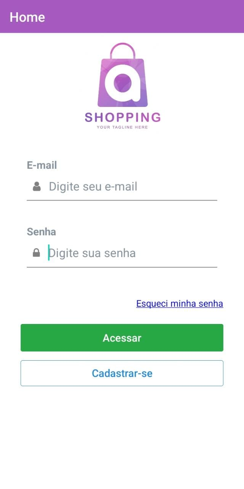
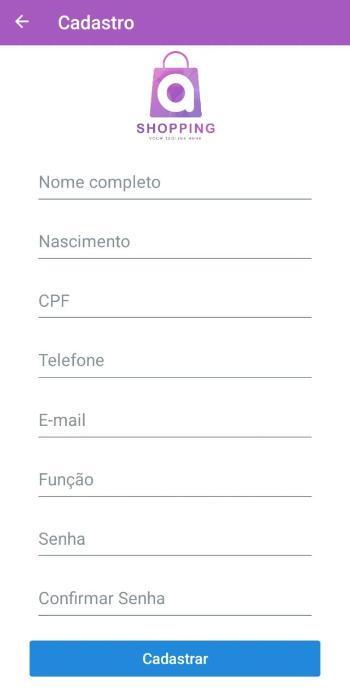

<h2>ShoppingMobile</h2>
 

<h3><strong>Tela de Login</strong></h3>
 

Ao abrir o aplicativo, a primeira tela que você encontrará é a de login. Nessa etapa, você precisará inserir suas credenciais de acesso, que normalmente consistem em um nome de usuário ou e-mail e uma senha. O campo "Acessar" é onde você pode efetuar o login utilizando suas informações de conta já cadastradas anteriormente.

 

<h3><strong>Botão "Cadastre-se"</strong></h3>
 

Caso você ainda não tenha uma conta no ShoppingMobile, pode utilizar a opção "Cadastre-se" presente na tela de login. Ao clicar nesse botão, você será direcionado para o formulário de registro, onde deverá fornecer algumas informações pessoais para criar sua conta no aplicativo. Essas informações geralmente incluem nome, e-mail, senha e talvez outros detalhes relevantes para o cadastro.

 

<h3><strong>Botão "Esqueci minha senha"</strong></h3>
 

Se por acaso você esquecer sua senha de acesso ao ShoppingMobile, não se preocupe! O aplicativo disponibiliza a opção "Esqueci minha senha" para ajudar a recuperá-la. Ao clicar nesse botão, você receberá instruções sobre como redefinir sua senha. Normalmente, isso envolve o recebimento de um e-mail com um link para redefinição, permitindo que você escolha uma nova senha para a sua conta.

